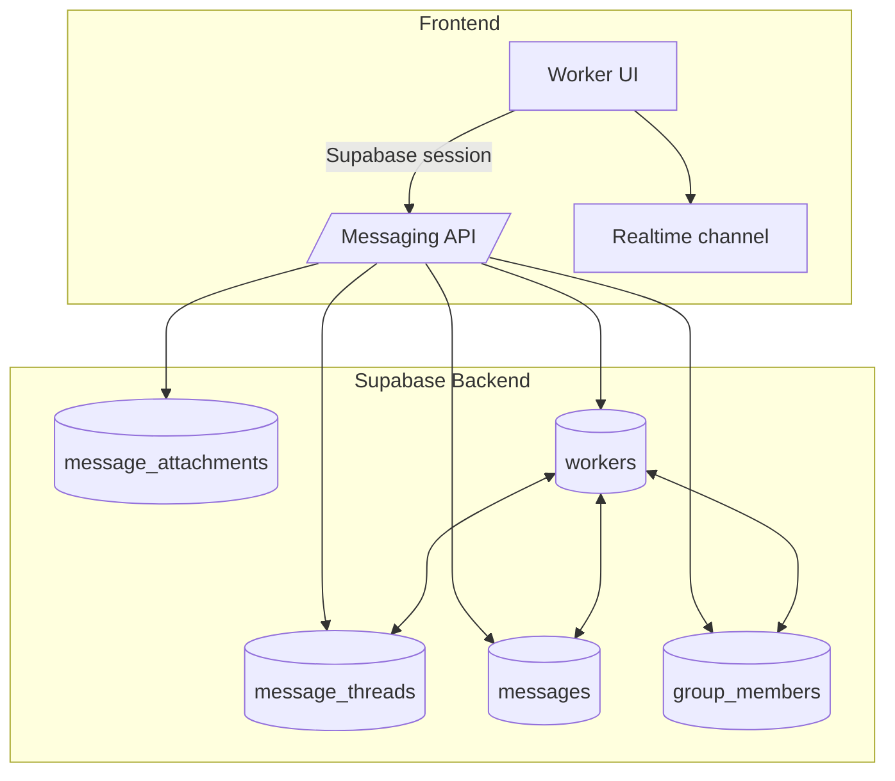

# PPH Connect Messaging Architecture

This document outlines the target messaging architecture for PPH Connect, comparing standalone and integrated options, defining API contracts, and showing how messaging ties into the workers table and related data.

## Architecture Decision

After evaluating a standalone microservice vs. integrating messaging within the existing PPH Connect backend, we recommend an **integrated module**.

**Standalone service vs integrated module (decision rationale)**
- Shared authentication + RLS policies already revolve around Supabase auth and the `worker_has_role` helper; reusing them avoids another auth boundary, extra secrets, and duplicated policy code.
- Messaging tables (`message_threads`, `messages`, `groups`, `group_members`, `message_attachments`) remain in the same Supabase project, enabling atomic joins with `workers`, `projects`, and `teams`.
- Edge functions (`send-message`, `validate-message-permissions`) still run independently, giving us modularity without provisioning a new service plane.
- Operating one Supabase project and CI/CD pipeline reduces on-call/load and makes incident response simpler than coordinating multiple services.

## API Contracts

| API | Method | Path | Description | Notes |
| --- | --- | --- | --- | --- |
| Conversations list | `GET` | `/api/messaging/threads` | Returns threads visible to the current worker/manager | Accepts `team_id`, `project_id`, pagination params |
| Message send | `POST` | `/api/messaging/send` | Inserts a message via edge function + storage attachments | Requires `thread_id` or `recipient_id`, optional attachments |
| Attachment pre-signed URL | `POST` | `/api/messaging/attachments/sign` | Returns signed URL for uploading attachments | Validates file type/size, uses new `messaging_attachments` bucket |
| Notifications | `GET` | `/api/messaging/unread` | Returns unread counts for nav badges | Backed by `useMessageNotifications` hook, polls fallback + realtime |

### Contract expectations

- All endpoints require Supabase session token; edge function verifies `worker_has_role` for writes.
- Responses include worker references (id, full_name, avatar) pulled via the canonical **`workers` table** join rather than `profiles`.
- Error codes align with existing API pattern (`MESSAGING_THREAD_NOT_FOUND`, `MESSAGING_ATTACHMENT_TOO_LARGE`).

**Workers table touchpoints**
- `workers` remains the canonical directory: message payloads embed `worker_id` + `full_name`.
- `group_members.worker_id` foreign key ensures membership follows worker lifecycle/status.
- Edge functions use `workers.status` (active/inactive) to block suspended accounts from posting.

## Data Flow & Worker Integration

- Threads reference `worker_id` directly. Group membership uses `group_members.worker_id` tied to the `workers` table, so messaging inherits lifecycle + status changes automatically.
- Messaging UI fetches worker display info (name, avatar) via `workers` join and caches via `useWorkers` hook.
- RLS leverages `worker_has_role(uid, ARRAY['root','admin','manager','team_lead','worker'])` to gate read/write access:
  - Workers can read threads where they appear in `group_members`.
  - Managers can read any thread within projects/teams they oversee via `project_id` filters.
- Event flow:
  1. Worker composes a message -> `send-message` edge function verifies membership + stores attachments in `messaging_attachments` bucket.
  2. Function inserts into `messages` table and broadcasts realtime payload on `messages:thread_id` channel.
  3. Clients with subscriptions update unread counts via `useMessageNotifications`, which references `worker_id` from `workers`.

## Standalone Service Considerations (Rejected)

- Would require duplicating auth + RLS logic, as well as syncing worker metadata into another database.
- Adds extra latency for cross-service joins (e.g., referencing worker status or teams) which PPH Connect messaging heavily relies on.
- Keeping messaging within the same Supabase project simplifies audit logging and reduces the number of deployment targets.
